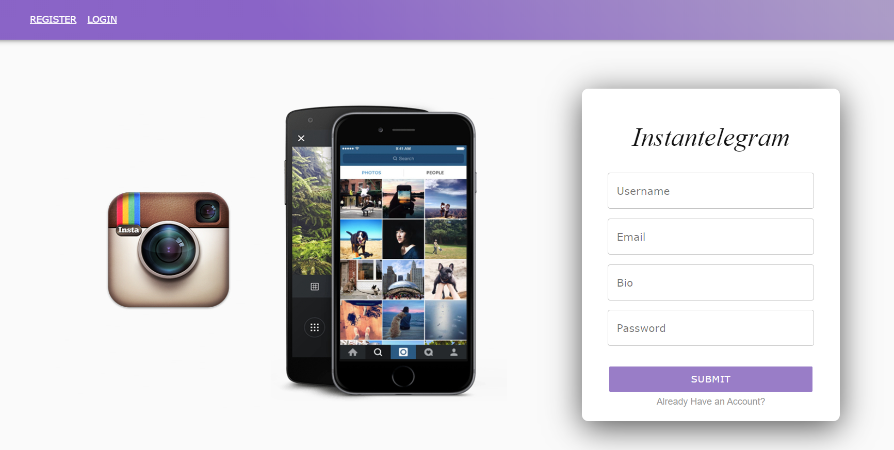

# Instantelegram

_By Seamus Le, Sean McLauglan, Riki Kaneshiro, Monia Techini - [Visit Instantelegram](https://instantelegram-aa.herokuapp.com/)_



Backend for app here: [Instantelegram-App-Backend](https://github.com/smclaughlan/instantelegramback)

# Table of Contents

- [Instantelegram Overview](#instantelegram-overview)
- [App Structure](#app-structure)
- [Technologies Used](#technologies-used)
  - [Frontend](#frontend)
  - [Backend](#backend)
- [More Documentation Links](#more-documentation-links)

# Instantelegram Overview

Instantelegram is meant to simulate a social image sharing website inspired by [Instagram](https://www.instagram.com/). Instantelegram brings people together. It allows users to upload media, follow and unfollow other users. Users can browse, like and comment other users' content.

Instantelegram employs a full stack app design utilizing a [React](https://reactjs.org/), [Redux](https://redux.js.org/), and [Material UI](https://material-ui.com/) for its frontend. [Flask](https://flask.palletsprojects.com/en/2.0.x/) and [PostgreSQL](https://www.postgresql.org/) are used for the backend. [Cloudinary](https://cloudinary.com/) is used as the image hosting service.

The main languages used in this app are:

1.  [JavaScript](https://www.javascript.com/) - Frontend
2.  [Python](https://www.python.org/) - Backend

# App Structure

## [Frontend](#frontend)

The frontend is what users see and interact with. It makes requests to the backend behind the scenes and stores the data using Redux.

## [Backend](#backend)

The backend is in charge of handling actions that users make on the frontend. It makes [CRUD](https://en.wikipedia.org/wiki/Create,_read,_update_and_delete) opertaions to the database and returns data that is requested.

### Database Model available [here](https://github.com/smclaughlan/instantelegram/blob/master/documentation/feature-packets/models.md).

# Technologies Used

Instantelegram requires both the frontend and backend to truly shine. Having a sleek UI to interact with and being able to reliably make CRUD operations to the database and Cloudinary were crucial to the app's functionality. Below are the technologies used in this project.

## Frontend

### [React](https://reactjs.org/)

Instantelegram's frontend takes advantage of React's ability to pass props, use hooks, include libraries built on top of React (such as [Material UI](#material-ui)), perform conditional rendering, and create components with their own states. These abilities allows for ease of development and increases the interactivity for users of the app.

### [Redux](https://redux.js.org/)

Redux is valuable as a means connect components to a store and have the data be passed where it is needed. This allowed us to circumvent having to pass data in one direction (parent to child) and opens up a variety of options to handle data.

### [Material UI](https://material-ui.com/)

Material UI allows for quick web development by providing components that are fully functional. These components also contain props (like other React components), allowing developers to customize as needed. An example of this can be seen in the Image component of Instantelegram (card that displays image, captions, etc.)

#### Example of Material UI Component (some parts removed for brevity)

```jsx
<Card className={classes.root}>
  <CardHeader
    avatar={
      <Avatar aria-label="recipe">
        
      </Avatar>
    }
    action={editButton}
    title={`${props.imagePosterUsername}`}
    subheader={<TimeAgo date={props.postDate} />}
  />
  <SRLWrapper>
    
  </SRLWrapper>

  <CardContent>
    <Typography>{props.imageCapt}</Typography>
    <form>...form stuff</form>
  </CardContent>
  <CardActions disableSpacing>
    {likeState ? (
      <IconButton aria-label="add to favorites" onClick={handleLike}>
        <FavoriteIcon color="secondary" />
      </IconButton>
    ) : (
      <IconButton aria-label="add to favorites" onClick={handleLike}>
        <FavoriteIcon />
      </IconButton>
    )}
    <div>{numOfLikes}</div>
    <IconButton
      className={clsx(classes.expand, {
        [classes.expandOpen]: expanded,
      })}
      onClick={handleExpandClick}
      aria-expanded={expanded}
      aria-label="show more"
    >
      <ExpandMoreIcon />
    </IconButton>
  </CardActions>
  <Collapse in={expanded} timeout="auto" unmountOnExit>
    <CardContent>
      <form onSubmit={submitComment}>
        <TextField />
        {submitEnabled ? (
          <Button>Submit</Button>
        ) : (
          <Button disabled>Submit</Button>
        )}
      </form>
      {props.comments[props.imageId]
        ? Object.keys(props.comments[props.imageId]).map((key) => {
            return <Comment />;
          })
        : null}
    </CardContent>
  </Collapse>
</Card>
```

## Backend

### [Flask](https://flask.palletsprojects.com/en/2.0.x/)

At the time of making, Flask was chosen as our backend framework since we were introduced to it (at least to my understanding - Seamus Le). Other than that, Flask was great at allowing us to choose how to build the application. It is minimalistic and allowed us to choose what libraries we wanted to use. It is also not opinionated, meaning that the structure is not rigid and can be shaped as needed.

### [PostgreSQL](https://www.postgresql.org/)

PostgreSQL was chosen as our database as there is a lot of relational data. As seen in our [database model](https://github.com/smclaughlan/instantelegram/blob/master/documentation/feature-packets/models.md), users, images, comments, likes, etc. all tend to point at one another in order to function. There is no specific reason for choosing specifically PostgreSQL over other SQL databases other than familiarity.

# Additional Documentation Links

- [Feature List](https://github.com/smclaughlan/instantelegram/blob/master/documentation/feature-list/features.md)
- [End Points](https://github.com/smclaughlan/instantelegram/blob/master/documentation/feature-packets/endpoints.md)
